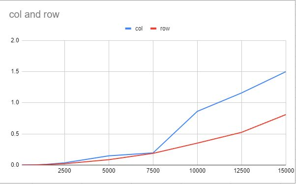

# Lab 4 - Matrix Multiplication Case Study 

## Introduction

For the lab this week you are also expected to perform a simple case study. It is meant to show
how important understanding a computer's architecture is, and the compiler is when developing
efficient code. For this study, you are to compare and analyze the execution time of the two
programs given in this repository in the files [program0.cpp](./program0.cpp) and [program1.cpp](./program1.cpp). You should run a number of experiments varying the input size from 100
to 30,000. Based on the results you are to write a report of your findings. The report should
contain a graph of your data and a useful analysis of it. You should draw conclusions based on
your findings. Reports that simply restate what is in the graph will not get credit. To make it
clear, make sure you used the concepts you have learned so far in 161 and 161L when
explaining the differences in performance. If a confusing or fuzzy explanation is given you will
get low or no marks. The report should be a part of REPORT.md.

### Building the Executables

Before running the experiments, it is necessary that you build the code associated with this lab in [program0.cpp](./program0.cpp) and [program1.cpp](./program1.cpp). These executables are built using CMake. CMake is available on Windows, Mac OS X and Linux, and is the default project file for Visual Studio Code. Therefore, be begin building the executables, open the folder containing these files in Visual Studio Code. Then from the Command Pallete type CMake and then select "CMake: Configure". This step creates the build files for this project. You may be asked to select a kit. This means to select a C++ compiler installed on your system. Once you have configured the CMake project, you can build the executables. These executables will be called matrix-mul-row and matrix-mul-col. 

If you don't have Visual Studio Code and the toolchain for C++, then you can do this project in a Codespace on GitHub, just as you've done in previous labs. As usual, create a repository by copying this template repository to a repository you own. Then go to Code -> Create Code Space. From there, follow the directions above to build the executables.

If for some reason you cannot do the CMake configuration and/or build in Visual Studio Code, then you can execute the following commands to configure and build the executables.

```sh
mkdir build
cmake -B ./build . # Configures the build system
cmake --build build # Build the executables
```

### Running the Executables

Once the executables are built, they can be run to observe how long matrix multiplications take when accessing the matrix either in row major or column major mode. If successful (it should always be successful), it will print out passed and the number of seconds take to do the matrix multiplication. 

The following is an example of running a single experiment for row major matrix multiplication:

```sh
./build/matrix-mul-row-major 100 # run matrix multiplication with 100 X 100 matrix
```

The folling is an example of running a single experiment for column major matrix multiplication:

```sh
./build/matrix-mul-col-major 100 # run matrix multiplication with 100 X 100 matrix
```

### Collecting Experimental Data

You will run each program separately and collect data regarding the amount of time need to perform the matrix multiplications. The difference between the two programs is how the data is accessed, a row at a time (row major) or a column at a time (column major). If you wish to read more about row vs. column major accesses, read the following [Wikipedia](https://en.wikipedia.org/wiki/Row-_and_column-major_order) article.

If you run these experiments with the same size several times, you notice that it may take different times. To take into account these differing times, run the experiments several times and take an average of the execution time for each matrix size and each ordering (row vs. column). Thise data will be used in the next section to create graph.

As described above, you will want to do matrices of sizes 100 to 30,000. You can do any spacing between experiments you will. In other words you don't need to do every size between 100 an 30,000 increasing by 100 each time. Rather you can make leaps in magnitude whenever it seems appropriate. Overall, you should perform exeriments for at least 10 different sizes between 100 and 30,000.

### Producing a Graph

Once you have collected all the data for both row and column major ordering, you will produce a graph to see which ordering performs better. You may use any software you want including Excel, OpenOffice Calc, Google Sheets, or even a Jupyter notebook. 

Create this graph and save it as either a PNG or JPG file to use in the lab report in the next section.

### The Lab Report

Finally, create a file called REPORT.md and use GitHub markdown to write your lab report. This lab
report will be relatively short. In the report show the graph you produced based on all your exeriments and describe your findings. Answer questions such as does row and column major ordering perform the same as the size of the matrices increases? Another good question is based on algorithm analysis and asymptotic notation, should there be a diffence in performance based on the use of row or column major ordering? Additionally, how does the performance difference grow as the size of the matrix grows? Linearly? Exponentially? Finally, conclude the report by why there is a difference in performance between the two different orderings.



## Submission:

Each student **must** turn in their repository from GitHub to Gradescope. The contents of which should be:
- A REPORT.md file with your name and email address, and the content described above
- All images of charts you created for this lab.
- There is no automated grading for this lab, since the only thing you're turning in is the lab report.

