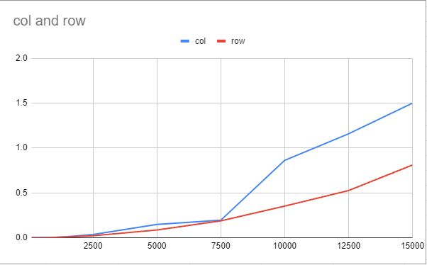

1) Answer questions such as does row and column major ordering perform the same as the size of the matrices increases? 
    No they do not, as the size of the matrices increases, row major ordering performs faster than column major ordering. 

2) Another good question is based on algorithm analysis and asymptotic notation, should there be a diffence in performance based on the use of row or column major ordering? 
    Based on the asymptotic notation, there should not be a difference in performance because their notation is both O(n^2). 

3) Additionally, how does the performance difference grow as the size of the matrix grows? Linearly? Exponentially?
    The performance grows linearly as the size of the matrix grows. 

4) Finally, conclude the report by why there is a difference in performance between the two different orderings.
    The difference in performance between the two different orderings is due to the cache utilization and memory hierachy access.
    This all depends on the amount of access to data in the cache before the data is replaced. This is about improving the temporal 
    locality to reduce cache misses.